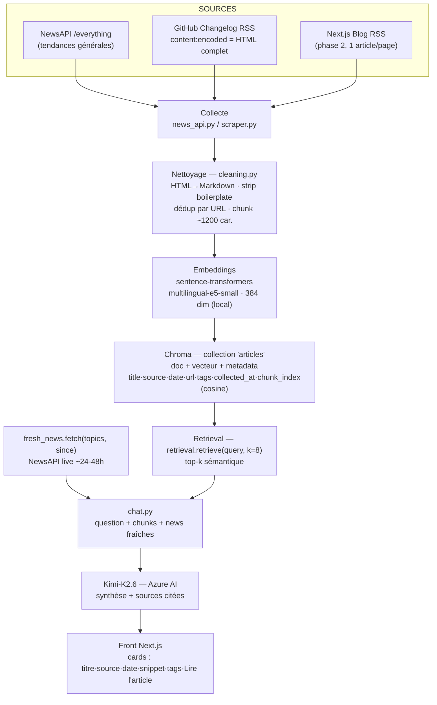

# Note de conception — Assistant de veille technologique

**Projet :** Nauda Palisse — pipeline d'ingestion + injection runtime pour l'assistant de veille
**Auteur :** Era Ramalingam Gandakumar
**Statut :** à valider par le formateur **avant** écriture du code (porte d'entrée du brief)
**Périmètre :** collecte (API + scraping), nettoyage, chunking, indexation Chroma, signaux frais

---

## 1. Contexte et besoin

L'équipe produit de Nauda Palisse (devs + PM + DevRel) perd une demi-journée par semaine de veille
éparpillée (Hacker News, changelogs RSS, newsletters…). La CTO veut un **assistant interne** capable de
répondre à des questions de type :

- « Quelles tendances reviennent cette semaine ? »
- « Quels outils sont les plus cités sur le sujet X ? »
- « Quels changements côté Vercel / OpenAI / Next.js cette semaine ? »

La stack RAG (FastAPI + Chroma + LangChain → Azure AI Inference / **Kimi-K2.6**) et le frontend Next.js
sont **déjà déployés sur une base vide**. Mon travail = **toute la collecte et l'injection runtime**.

> **Contrainte structurante héritée du code existant.**
> Le module `app/rag/llm.py` (fonction `_build_cards`) lit déjà, pour fabriquer les cartes affichées
> dans l'UI, exactement ces clés de métadonnées : **`title`, `source`, `date`, `url`, `tags`**.
> Mon modèle de métadonnées n'est donc **pas un choix libre** : chaque chunk indexé dans Chroma **doit**
> porter ces champs, sinon les cartes du frontend s'affichent vides.

---

## 2. Quelles sources indexer ? (et pourquoi)

Principe directeur : **commencer simple avec une source précise et structurée**, valider le pipeline de
bout en bout, **puis élargir**. On ne cherche pas à « scraper tout le web ».

| # | Source | Type | Accès | Ce qu'elle apporte à l'assistant |
|---|--------|------|-------|----------------------------------|
| **A** | **NewsAPI** (`/everything`) | API agrégateur | Clé API, JSON paginé | **Largeur** : tendances générales multi-sources sur un mot-clé/sujet. Couvre le bruit ambiant et les sujets émergents. |
| **B** | **GitHub Changelog** (`https://github.blog/changelog/feed/`) | Changelog produit | **Flux RSS 2.0** | **Profondeur officielle** : annonces vérifiées (releases, dépréciations d'API). Le flux contient le HTML complet (`content:encoded`) + des `category` réutilisables en tags. |
| **C** | **Next.js Blog** (`https://nextjs.org/feed.xml`) | Blog technique / annonces | **Flux RSS 2.0** | **Écosystème ciblé** (web / JavaScript) : releases et explications de fond. Le flux ne donne que le résumé → on va chercher l'article (cas « 1 article par page »). *Phase 2.* |

**Justification du choix de départ (phase 1) : GitHub Changelog.**
Le flux RSS expose un **XML stable** (insensible aux redesigns HTML) et, surtout, le **contenu complet
dans `content:encoded`** : on récupère tout en **une seule requête**, prêt pour le nettoyage HTML→Markdown.
C'est un **changelog produit**, l'une des trois catégories demandées par le brief, et la matière colle
directement aux questions « Quels changements côté X cette semaine ? ».

**Le scraping dépend de la structure de la page** — trois cas, traités progressivement :
1. **Plusieurs articles par page** → le flux RSS lui-même (liste de `<item>`). *Phase 1.*
2. **Un article par page** → page de détail à parser (`<article>`), ex. Next.js Blog. *Phase 2.*
3. **Contenu dynamique (rendu JS)** → ex. changelog Vercel. **Écarté en phase 1** : nécessiterait un
   navigateur headless (Playwright), hors périmètre.

---

## 3. Chunks et métadonnées

### 3.1 Granularité des chunks
- **Découpage par taille de caractères** (≈ **1200 caractères/chunk**), pas par tokens.
  → Pas de dépendance à un tokenizer ; cohérent avec la signature `chunk(text, max_chars=1200)` de
  `app/ingest/cleaning.py`.
- **Pourquoi pas l'article entier ?** Un changelog peut être long et multi-sujets : des chunks plus fins
  améliorent la **précision du retrieval** (on ramène le passage pertinent, pas tout l'article).
- **Pourquoi pas le paragraphe pur ?** Trop fragmenté → perte de contexte. Le découpage à taille fixe
  (avec coupe sur fin de phrase si possible) est un bon compromis simplicité/qualité pour la phase 1.

### 3.2 Modèle de métadonnées (imposé par `llm.py` + traçabilité)

| Champ | Type | Source | Rôle |
|-------|------|--------|------|
| `title` | str | titre article | Affiché sur la carte UI |
| `source` | str | label normalisé (`"GitHub Changelog"`, `"NewsAPI"`, `"Next.js Blog"`) | Filtrage + affichage |
| `date` | str `YYYY-MM-DD` | date de publication normalisée | Tri / fraîcheur / affichage |
| `url` | str | lien canonique de l'article | **Traçabilité** + bouton « Lire l'article » |
| `tags` | list[str] | `category` RSS / sujets | Tags colorés UI |
| `collected_at` | str ISO 8601 | horodatage de collecte | **Traçabilité** (date de collecte exigée par le brief) |
| `chunk_index` | int | position du chunk dans l'article | Recomposition / debug |

> **Traçabilité (critère de perf du brief).** `url` + `collected_at` garantissent que **chaque chunk
> remonte jusqu'à sa source d'origine**.

### 3.3 Normalisation
- **Dates** : tout format d'entrée (RFC 822 RSS `Wed, 18 Mar 2026 20:00:00 GMT`, ISO NewsAPI…) →
  **`YYYY-MM-DD`** unique. Si date absente → `null`.
- **Sources** : libellé **canonique** par source (pas l'URL brute du domaine). Une table de correspondance
  domaine → label assure la cohérence d'affichage et de filtrage.
- **Déduplication** : par **URL** (clé naturelle d'unicité). `cleaning.dedupe` supprime les doublons
  d'URL ; les `id` de chunk sont dérivés de façon déterministe (`hash(url) + "_" + chunk_index`) →
  un `upsert` répété **n'introduit pas de doublon**.

---

## 4. Signaux frais (`fresh_news`)

**Quoi :** au moment du chat, un appel **live** à **NewsAPI** récupère l'actualité **très récente**
(fenêtre ~24–48 h) sur les sujets de la question — articles **non encore indexés** dans Chroma.

**Pourquoi un canal séparé de l'index ?**
- L'index Chroma reflète l'état de la **dernière ingestion** (batch). Il y a forcément un **délai**.
- Les questions de veille sont **temporellement sensibles** (« cette semaine », « les derniers changements »).
- L'injection runtime garantit que la **toute dernière actu** apparaît, même si l'ingestion n'a pas
  encore tourné. C'est le rôle de `app/runtime/fresh_news.py` (`fetch(topics, since)`).

**Distinction clé à retenir :**
| | Index Chroma | Signaux frais |
|---|---|---|
| Moment | **Batch** (ingestion) | **Runtime** (au chat) |
| Source | RSS + scraping + NewsAPI nettoyés, vectorisés | NewsAPI live |
| Persistance | stocké/vectorisé | éphémère, non indexé |
| Rôle | mémoire de la veille | dernière minute |

Les deux flux **fusionnent dans `app/chat.py`** avant la composition LLM.

---

## 5. Architecture — schéma de flux complet



**Légende du flux :** Sources → Collecte (API + scraping/RSS) → Nettoyage (HTML→MD, dédup, chunking,
boilerplate) → Embeddings (local) → Indexation Chroma → Retrieval top-k **+** injection runtime des
signaux frais → Composition LLM (Kimi-K2.6) → Cartes dans l'UI.

> **Correctifs par rapport au 1er jet de schéma** (alignés sur le code réel) :
> - Embeddings = **sentence-transformers `multilingual-e5-small`, 384 dim, local** (et **non** OpenAI 1536).
> - Chunking = **~1200 caractères** (et non « 500 tokens · overlap 50 »).
> - La requête Chroma principale = **`retrieval.retrieve(k=8)`** (sémantique top-k) ; `enrich_retrieval()`
>   est un **hook de post-traitement optionnel**, pas la requête principale.

---

## 6. Modèle des chunks stockés dans Chroma

Collection unique **`articles`** (espace **cosine**). Pour chaque chunk :

```jsonc
// 1 entrée Chroma = 1 chunk
{
  "id":        "a1b2c3d4_0",                  // hash(url) + "_" + chunk_index (déterministe → upsert idempotent)
  "document":  "Texte Markdown nettoyé du chunk (~1200 caractères).",
  "embedding": [/* 384 floats, multilingual-e5-small */],
  "metadata": {
    "title":        "GitHub Copilot CLI — voice input",
    "source":       "GitHub Changelog",       // label canonique normalisé
    "date":         "2026-06-03",             // YYYY-MM-DD
    "url":          "https://github.blog/changelog/2026-06-03-...",
    "tags":         ["copilot", "cli"],       // depuis <category> RSS
    "collected_at": "2026-06-04T10:12:00Z",   // traçabilité
    "chunk_index":  0
  }
}
```

---

## 7. Synthèse des décisions (à valider)

1. **Sources** : NewsAPI (largeur) + GitHub Changelog RSS (profondeur officielle, **départ phase 1**) ;
   Next.js Blog RSS en élargissement. Dynamique (Vercel) écarté.
2. **Chunks** : taille fixe ≈ 1200 caractères, dédup par URL, `id` déterministe.
3. **Métadonnées** : `title, source, date, url, tags` (imposés par l'UI) + `collected_at`, `chunk_index`
   (traçabilité). Dates → `YYYY-MM-DD`, sources → label canonique.
4. **Signaux frais** : NewsAPI live (~24–48 h) injecté au runtime, séparé de l'index.
5. **Embeddings** : `multilingual-e5-small` local (384 dim), cosine.

*Une fois cette note validée, démarrage du développement (`news_api.py`, `scraper.py`, `cleaning.py`,
`fresh_news.py`, CLI).*
