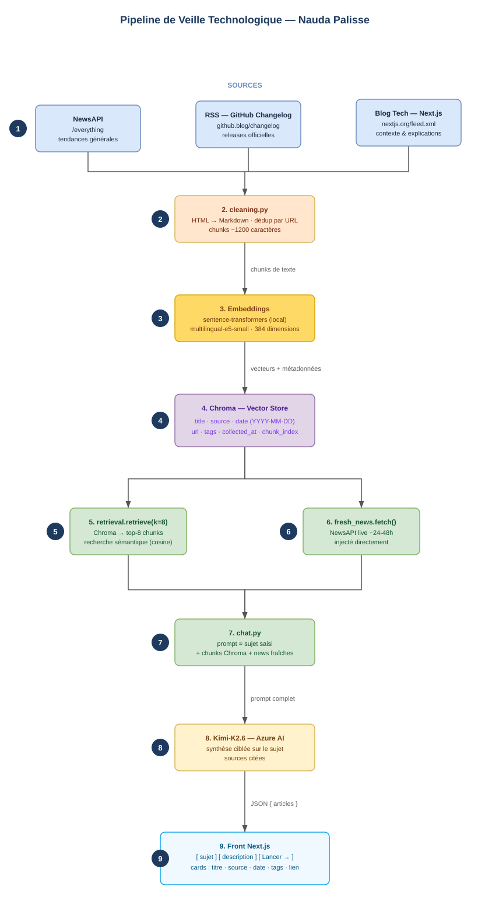

# Note de conception — Assistant de veille technologique

**Projet :** Nauda Palisse — pipeline d'ingestion et injection de news fraîches
**Auteur :** Eramalingam Gandakumar
**Objet :** document préparatoire à valider avant le développement

## Le problème que je dois résoudre

Chez Nauda Palisse, l'équipe produit passe une demi-journée par semaine à faire de la veille, éparpillée entre Hacker News, Twitter, des changelogs et des newsletters. La CTO veut centraliser tout ça dans un assistant interne qui sache répondre à des questions concrètes comme « quelles tendances reviennent cette semaine ? » ou « quels changements côté Vercel ou Next.js ? ».

La partie RAG (FastAPI, Chroma, LangChain et le modèle Kimi-K2.6 via Azure) ainsi que le frontend Next.js sont déjà en place, mais la base est vide. Mon travail consiste donc à construire toute la chaîne qui va la remplir : collecte, nettoyage, découpage, indexation, et l'injection des news fraîches au moment du chat.

Un point important a guidé mes choix : le code existant n'est pas neutre. La fonction `_build_cards` dans `app/rag/llm.py` lit déjà des clés précises (`title`, `source`, `date`, `url`, `tags`) pour fabriquer les cartes affichées à l'écran. Mes métadonnées ne sont donc pas un choix libre : si un chunk ne porte pas ces champs, la carte s'affiche vide. J'ai construit toute ma conception en partant de cette contrainte.

## 1. Les sources que je vais indexer

J'ai préféré commencer avec une source précise et bien structurée, valider que le pipeline fonctionne de bout en bout, puis élargir ensuite. L'idée n'est pas de vouloir « scraper tout le web ».

J'ai retenu trois sources, chacune avec un rôle différent :

- **NewsAPI** (endpoint `/everything`) m'apporte de la **largeur** : c'est un agrégateur, donc il couvre les tendances générales et les sujets qui émergent un peu partout, à partir d'un mot-clé.
- **Le changelog GitHub** (flux RSS `https://github.blog/changelog/feed/`) m'apporte de la **profondeur officielle** : ce sont des annonces vérifiées (nouvelles versions, dépréciations d'API). C'est ma source de départ.
- **Le blog Next.js** (flux RSS `https://nextjs.org/feed.xml`) cible **l'écosystème web/JavaScript**, directement lié à la stack du SaaS. Je l'ajouterai en deuxième temps.

**Pourquoi commencer par le changelog GitHub ?** En regardant le flux de près, j'ai vu qu'il expose le contenu complet de chaque article dans le champ `content:encoded`. Je récupère donc tout en une seule requête, sans avoir à aller chercher chaque page. Le flux RSS est aussi un format XML stable, qui ne casse pas quand le site change de design — contrairement au scraping HTML brut. Et c'est justement un changelog produit, l'une des trois catégories demandées dans le brief.

Le scraping dépend beaucoup de la structure des pages, et j'ai identifié trois cas que je traite progressivement :

1. **Plusieurs articles sur une même page** : c'est le cas du flux RSS, qui contient une liste d'entrées. C'est ma phase 1.
2. **Un article par page** : il faut alors aller chercher chaque page de détail et lire son contenu (par exemple le blog Next.js, dont le flux ne donne que le résumé). C'est ma phase 2.
3. **Contenu chargé dynamiquement en JavaScript** : comme le changelog de Vercel. Je l'écarte volontairement pour l'instant, car il faudrait un navigateur automatisé (Playwright), ce qui sort du périmètre de cette première phase.

## 2. Mes chunks et mes métadonnées

**Granularité.** Je découpe le texte par taille, en morceaux d'environ 1200 caractères, plutôt qu'en tokens (ça m'évite de dépendre d'un tokenizer, et c'est cohérent avec la fonction `chunk(text, max_chars=1200)` du projet). Je n'indexe pas l'article entier d'un bloc, car un changelog peut être long et traiter plusieurs sujets : des chunks plus fins permettent de ramener le bon passage au moment de la recherche. À l'inverse, découper paragraphe par paragraphe serait trop fragmenté et ferait perdre le contexte. Le découpage à taille fixe, en coupant sur un espace pour ne pas casser un mot, est un bon compromis.

**Métadonnées.** Chaque chunk indexé dans Chroma porte les champs suivants :

| Champ | Rôle |
|-------|------|
| `title` | titre affiché sur la carte |
| `source` | nom normalisé de la source (« GitHub Changelog », « NewsAPI »…) |
| `date` | date de publication, au format `YYYY-MM-DD` |
| `url` | lien vers l'article original (bouton « Lire l'article ») |
| `tags` | mots-clés, repris des catégories RSS |
| `collected_at` | date de collecte, pour la traçabilité |
| `chunk_index` | position du chunk dans l'article |

Les cinq premiers sont imposés par le frontend ; les deux derniers servent à garantir qu'on peut toujours remonter un chunk jusqu'à sa source, ce que le brief demande explicitement.

**Normalisation.** Les dates arrivent dans des formats variés (le RSS utilise un format type `Wed, 18 Mar 2026 20:00:00 GMT`, NewsAPI un format ISO) ; je les ramène toutes à `YYYY-MM-DD`, et je laisse la date à `null` si elle est absente. Pour les sources, j'utilise un libellé propre et constant plutôt que l'URL brute du domaine, ce qui rend l'affichage et le filtrage cohérents. Enfin, je déduplique par URL : c'est la clé naturelle d'un article, et comme je construis l'identifiant d'un chunk de façon déterministe (un hash de l'URL + le numéro de chunk), relancer l'ingestion ne crée pas de doublons.

## 3. Les signaux frais

Au moment du chat, je fais un appel en direct à NewsAPI pour récupérer l'actualité très récente (une fenêtre d'environ 24 à 48 heures) sur les sujets de la question. Ce sont des articles qui ne sont pas encore dans l'index.

Pourquoi un canal séparé de l'index Chroma ? Parce que l'index reflète l'état de la dernière ingestion, et il y a forcément un décalage. Or les questions de veille sont sensibles au temps (« cette semaine », « les derniers changements »). En injectant ces news au moment du chat, je m'assure que la toute dernière actualité apparaît, même si l'ingestion n'a pas encore tourné. C'est le rôle de `fetch(topics, since)` dans `app/runtime/fresh_news.py`. Les deux flux — l'index et les signaux frais — se rejoignent ensuite dans `app/chat.py` avant d'être envoyés au modèle.

Pour résumer la différence : l'index est la mémoire de la veille, constituée par lots ; les signaux frais sont la dernière minute, récupérée en direct et non stockée.

## 4. Le schéma du flux



Le même schéma au format Mermaid (il s'affiche directement sur GitHub) est dans `schema-flux.md`.

En une phrase : les sources passent par la collecte (API et RSS), sont nettoyées et découpées, vectorisées par un modèle local, puis stockées dans Chroma ; au moment du chat, on combine les chunks retrouvés et les news fraîches, le modèle rédige une réponse sourcée, et le frontend l'affiche sous forme de cartes.

Pour information, ce schéma a été calé sur le code réel : l'embedding se fait avec le modèle local `intfloat/multilingual-e5-small` (384 dimensions), pas avec un service externe, et la requête principale vers Chroma est `retrieve(query, k=8)`.

## 5. Le modèle d'un chunk dans Chroma

La collection s'appelle `articles` et utilise la distance cosine. Chaque entrée correspond à un chunk et ressemble à ceci :

```jsonc
{
  "id":        "a1b2c3d4_0",                  // hash(url) + "_" + numéro de chunk → idempotent
  "document":  "Texte Markdown nettoyé du chunk (~1200 caractères).",
  "embedding": [/* 384 nombres, modèle intfloat/multilingual-e5-small */],
  "metadata": {
    "title":        "GitHub Copilot CLI — voice input",
    "source":       "GitHub Changelog",
    "date":         "2026-06-03",
    "url":          "https://github.blog/changelog/2026-06-03-...",
    "tags":         ["copilot", "cli"],
    "collected_at": "2026-06-04T10:12:00Z",
    "chunk_index":  0
  }
}
```

## Ce que je propose de valider

En résumé, voici mes décisions :

1. **Sources** : NewsAPI pour la largeur, le changelog GitHub (RSS) comme point de départ, et le blog Next.js en élargissement. Les sources dynamiques sont écartées pour l'instant.
2. **Chunks** : découpage à taille fixe (~1200 caractères), déduplication par URL, identifiant déterministe.
3. **Métadonnées** : les cinq champs imposés par l'interface, plus `collected_at` et `chunk_index` pour la traçabilité ; dates et sources normalisées.
4. **Signaux frais** : NewsAPI en direct sur 24-48 heures, injecté au moment du chat, séparé de l'index.
5. **Embeddings** : modèle local `intfloat/multilingual-e5-small`, en 384 dimensions, distance cosine.

Une fois ces choix validés, je passe au développement des modules de collecte, de nettoyage et d'injection.
