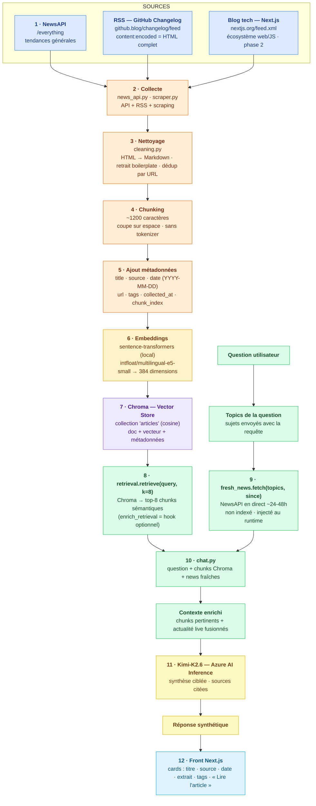

# Schéma du flux — Pipeline de veille technologique (Nauda Palisse)

```mermaid
flowchart TD
    %% ---------- SOURCES ----------
    subgraph SRC[" SOURCES "]
        direction LR
        A["<b>1 · NewsAPI</b><br/>/everything<br/>tendances générales"]
        B["<b>RSS — GitHub Changelog</b><br/>github.blog/changelog/feed<br/>content:encoded = HTML complet"]
        C["<b>Blog tech — Next.js</b><br/>nextjs.org/feed.xml<br/>écosystème web/JS · phase 2"]
    end

    A --> COL
    B --> COL
    C --> COL

    %% ---------- PIPELINE BATCH ----------
    COL["<b>2 · Collecte</b><br/>news_api.py · scraper.py<br/>API + RSS + scraping"]
    COL --> NET

    NET["<b>3 · Nettoyage</b><br/>cleaning.py<br/>HTML → Markdown · retrait boilerplate · dédup par URL"]
    NET --> CHK

    CHK["<b>4 · Chunking</b><br/>~1200 caractères<br/>coupe sur espace · sans tokenizer"]
    CHK --> META

    META["<b>5 · Ajout métadonnées</b><br/>title · source · date (YYYY-MM-DD)<br/>url · tags · collected_at · chunk_index"]
    META --> EMB

    EMB["<b>6 · Embeddings</b><br/>sentence-transformers (local)<br/>intfloat/multilingual-e5-small → 384 dimensions"]
    EMB --> CH

    CH["<b>7 · Chroma — Vector Store</b><br/>collection 'articles' (cosine)<br/>doc + vecteur + métadonnées"]
    CH --> RET

    %% ---------- RUNTIME ----------
    RET["<b>8 · retrieval.retrieve(query, k=8)</b><br/>Chroma → top-8 chunks sémantiques<br/>(enrich_retrieval = hook optionnel)"]

    USR["<b>Question utilisateur</b>"]
    USR --> TOP
    TOP["<b>Topics de la question</b><br/>sujets envoyés avec la requête"]
    TOP --> FN
    FN["<b>9 · fresh_news.fetch(topics, since)</b><br/>NewsAPI en direct ~24-48h<br/>non indexé · injecté au runtime"]

    RET --> CHAT
    FN --> CHAT

    CHAT["<b>10 · chat.py</b><br/>question + chunks Chroma + news fraîches"]
    CHAT --> ENRICH

    ENRICH["<b>Contexte enrichi</b><br/>chunks pertinents + actualité live fusionnés"]
    ENRICH --> LLM

    LLM["<b>11 · Kimi-K2.6 — Azure AI Inference</b><br/>synthèse ciblée · sources citées"]
    LLM --> REP

    REP["<b>Réponse synthétique</b>"]
    REP --> UI

    UI["<b>12 · Front Next.js</b><br/>cards : titre · source · date · extrait · tags · « Lire l'article »"]

    %% ---------- STYLES ----------
    classDef src   fill:#dbeafe,stroke:#3b82f6,color:#1e3a8a;
    classDef clean fill:#ffedd5,stroke:#f97316,color:#7c2d12;
    classDef emb   fill:#fef3c7,stroke:#f59e0b,color:#78350f;
    classDef store fill:#ede9fe,stroke:#8b5cf6,color:#4c1d95;
    classDef run   fill:#dcfce7,stroke:#22c55e,color:#14532d;
    classDef llm   fill:#fef9c3,stroke:#eab308,color:#713f12;
    classDef front fill:#e0f2fe,stroke:#0ea5e9,color:#075985;

    class A,B,C src;
    class COL,NET,CHK,META clean;
    class EMB emb;
    class CH store;
    class USR,TOP,RET,FN,CHAT,ENRICH run;
    class LLM,REP llm;
    class UI front;
```

